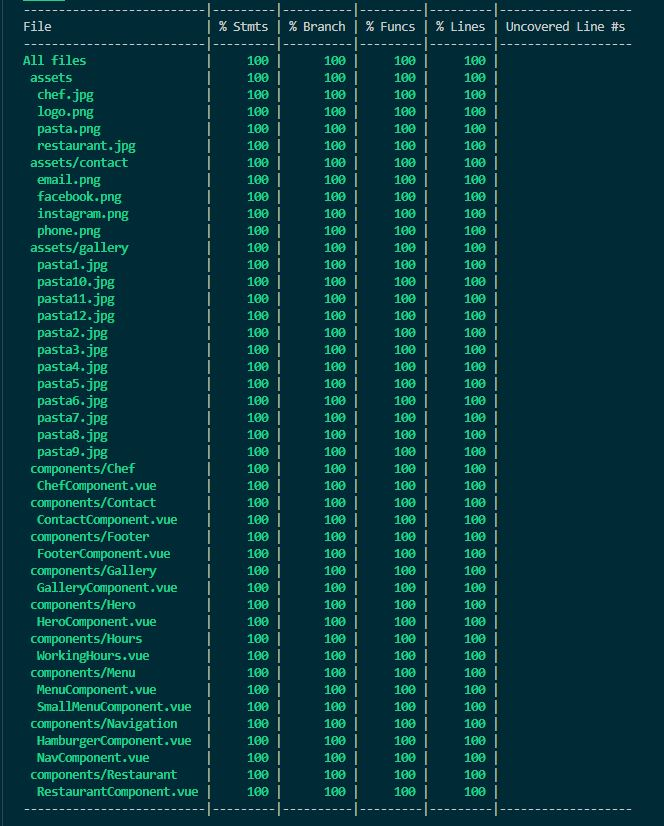
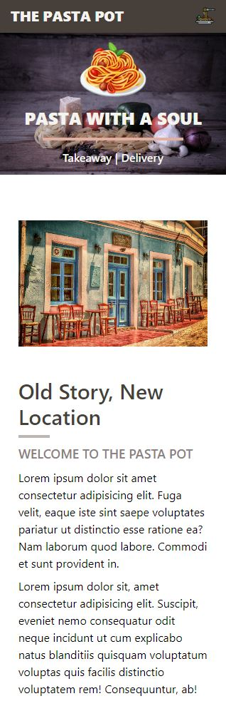
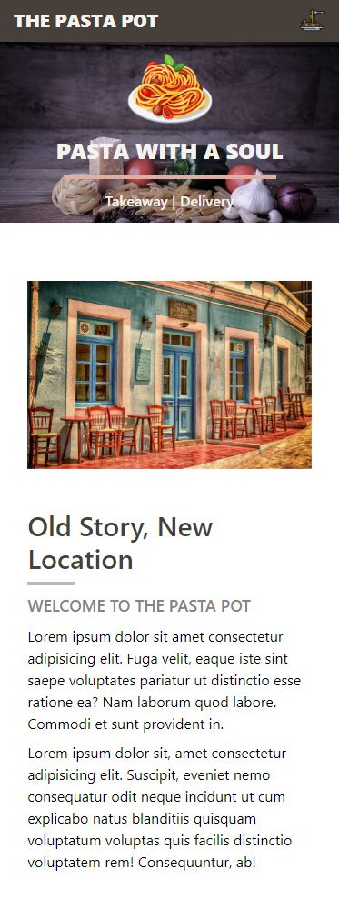
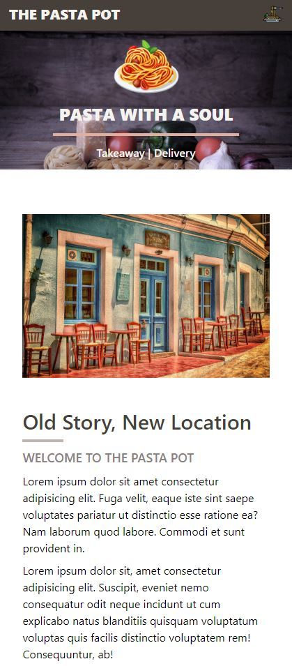
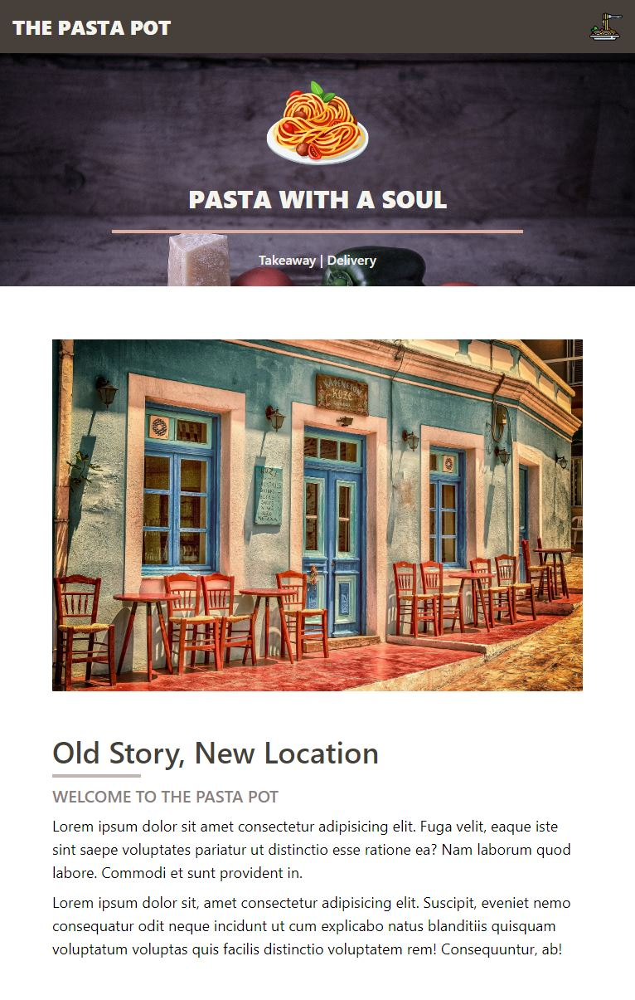
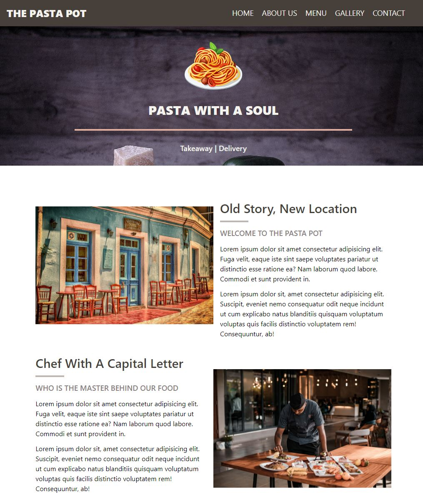
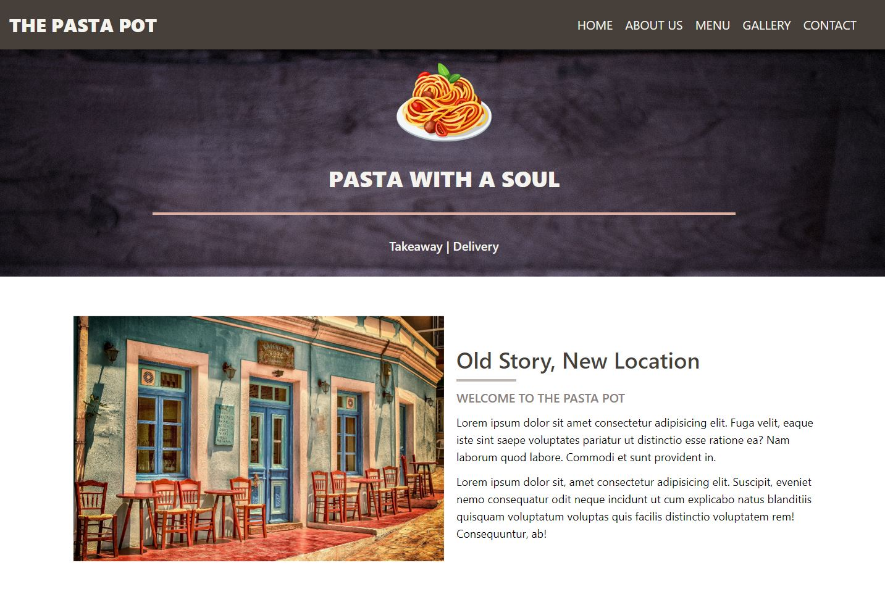
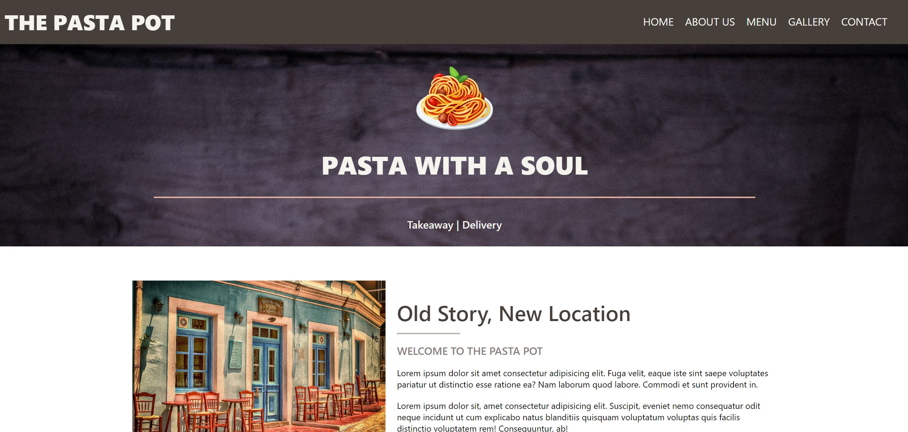

# THE PASTA POT - a simple restaurant page

This project was inspired by a [simple page from an asian restaurant](https://www.rizevaskleda.com/) that recently opened near me. I really liket the simple, jet effective design and thought that this project would be great for me, to use as an exercise in testing. This is the first time I used Cypress as a testing tool for component testing. I used Jest for unit testing.  
I followed the TDD workflow, writing a unit test in Jest, and then writing the code to make the test pass. After that I refractured the code, if needed. The project is tested extensively, probably even too much. I tested everything that I could, because I wanted to really get intimate with the syntax. I understand that in a real life project this much testing would not be required, in fact it would probably be a waste of time, since there is a lot of trivial testing.

  

I used alpinejs, more specifically the plugin intersect, to add animations to the site. I found this to be the easiest way to add animations, that trigger when the user scrolls down the page. This can be done with other technologies, but is much more time consuming. Installing it via npm did not work, so I used CDN links for alpine and alpine/intersect to make the framework work.
  
I defined all of the animation keyframes and classes in the index.css file and than used `x-intersect="$el.classList.add('class')"` on the components that I wanted to be animated. It is a really simple and straitforward process.

## Screenshots:

 

### Mobile layout:

 

 320px

  

 375px

  

 425px

### Tablet layout:

  

 768px

### Laptop layout:

  

 1024px

  

 1440px

  

 2560px

## Technologies used:

- [VUE.js](https://cli.vuejs.org/) - Javascript framework - used because I really like working with it and enjoy the workflow
- [Tailwindcss](https://tailwindcss.com/) - CSS framework - used because I like working with it and it enables me to style components quickly, meaning I can use my time for other things that I find more important (like testing).
- [Alpine Intersect Plugin](https://alpinejs.dev/plugins/intersect)- used for animation
- [Jest](https://jestjs.io/) - used for unit testing Vuejs components
- [Cypress](https://docs.cypress.io/) - used for component testing of Vuejs components
- [Vue test utils](https://test-utils.vuejs.org/installation/) - used in conjunction with Jest
- [Vue testing library](https://testing-library.com/docs/vue-testing-library/intro) - used in conjunction with Jest
- [DOM testing library](https://testing-library.com/docs/dom-testing-library/install) - used in conjunction with Jest
- [User event testing library](https://testing-library.com/docs/user-event/install) - used in conjunction with Jest
- [Jest dom testing library](https://testing-library.com/docs/ecosystem-jest-dom) - used in conjunction with Jest
- [Cypress testing library](https://testing-library.com/docs/cypress-testing-library/intro/) - used in conjunction with Cypress
- [Hamburger icon](https://www.flaticon.com/free-icon/pasta_2515207?term=pasta&related_id=2515207) - icon for the hamburger menu
- [Pictures source](https://pixabay.com/photos/search/pasta/?manual_search=1&pagi=2) - royalty free pictures
